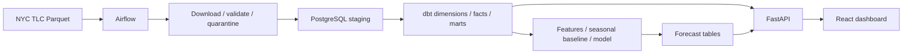

# MetroPulse

Urban mobility analytics and demand forecasting using New York City Yellow Taxi records.

**Status: Milestone 1 — foundation and tested downloader.** This repository currently downloads and profiles source data and runs a React foundation page. PostgreSQL loading, dbt models, FastAPI analytics, dashboard metrics, forecasting, Airflow, Docker Compose, and GitHub Actions are planned; they are not implemented or claimed to work yet.

## Questions the finished platform will answer

- When is taxi demand highest, and which zones are busiest?
- How do revenue, fares, distance, duration, and weekday/weekend patterns change?
- What hourly pickup demand is predicted next?
- Did the last pipeline succeed, and how many records were accepted, quarantined, or duplicates?

This is historical analysis, not live GPS tracking.

## Architecture



Only the downloader, raw-data profiling, and frontend foundation exist today. See [architecture](docs/architecture.md) and [decisions](docs/decisions/0001-incremental-foundation.md).

## Technology

Current: Python 3.12, uv, HTTPX, PyArrow, pytest/coverage, Ruff, mypy, React, TypeScript, Vite, CSS Modules, ESLint, Prettier, Vitest, React Testing Library, Git, and VS Code.

Planned: FastAPI, Pydantic/settings, SQLAlchemy 2, Alembic, PostgreSQL, pandas, dbt-postgres, Airflow, scikit-learn/joblib, TanStack Query, React Router, Recharts, Docker Compose, and GitHub Actions.

## Quick start

Prerequisites: Git, Python 3.12 or uv-managed Python, [uv](https://docs.astral.sh/uv/getting-started/installation/), Node.js 22.12+, npm, and VS Code. Docker Desktop will be required in a later milestone.

```bash
git clone https://github.com/Oala-bot/metropulse-data-platform.git
cd metropulse-data-platform
uv sync --locked
npm --prefix frontend ci
cp .env.example .env
code .
npm --prefix frontend run dev
```

Open http://localhost:5173. Install the recommended VS Code extensions. Python uses `.venv/bin/python`; the debugger includes a working downloader configuration. Tasks marked “future milestone” and the FastAPI debug configuration are reserved and will not work yet.

The downloader uses exported environment variables or CLI flags; it does **not** automatically read `.env` in this milestone. No credentials are needed to download public data.

## Download and profile

```bash
uv run python -m ingestion.download --year 2025 --month 1 --taxi-type yellow
uv run python -m ingestion.profile data/raw/yellow_tripdata_2025-01.parquet --output docs/january-2025-profile.json
```

With the virtual environment activated, the requested plain Python command also works:

```bash
source .venv/bin/activate
python -m ingestion.download --year 2025 --month 1 --taxi-type yellow
```

Change `--month` to `2` or `3` for the other initial source months. Add `--force` to refresh a previously downloaded file. `--output-dir` overrides `RAW_DATA_DIR`; `--base-url` overrides `TLC_BASE_URL`. Only Yellow Taxi is supported. Years must be 2009 through the current year; source availability is checked by HTTP, and unpublished months fail clearly.

Downloads stream in 1 MiB blocks, with connect/read timeouts and up to three attempts for transient failures. Each completed file gets a SHA-256 JSON sidecar. Skipping verifies local bytes against that sidecar and checks the URL; it does not detect upstream revisions. Interrupted transfers never replace an existing file. Do not run concurrent downloads for the same month.

Raw files are Git-ignored. Tests use mock HTTP and tiny generated fixtures; they never download full datasets.

## Measured source profile

The January 2025 download contains **3,475,226 records**, **20 columns**, and **59,158,238 bytes**. SHA-256: `9af277e4c0d3f9deb30644da822981e1e7df6af58313170fd3aa8a474485488a`.

Full-file profiling found 540,149 null passenger counts, 144,118 negative fares, 63,037 negative totals, and 2,051 records whose pickup is not before drop-off. Counts overlap. These are observations, not accepted/rejected counts; cleaning rules and quarantine will be implemented next. The unusually large distance and fare maxima need explicit validation policies. See [the reproducible profile](docs/january-2025-profile.json).

## Checks

```bash
uv run ruff check .
uv run ruff format --check .
uv run mypy
uv run pytest --cov=ingestion --cov-report=term-missing
npm --prefix frontend run lint
npm --prefix frontend run format:check
npm --prefix frontend run typecheck
npm --prefix frontend test
npm --prefix frontend run build
```

Or run `make check test`. Python dependencies are locked in `uv.lock`; frontend dependencies in `frontend/package-lock.json`. See [Milestone 1 verification](docs/milestone-1.md). CI workflows and badges will be added in the CI milestone, not simulated here.

## Dataset attribution

Source: [NYC Taxi and Limousine Commission trip records](https://www.nyc.gov/site/tlc/about/tlc-trip-record-data.page). Data is supplied to TLC by providers; TLC does not guarantee accuracy. The 2025 schema includes `cbd_congestion_fee`. The repository's MIT license covers project code, not ownership of the upstream dataset.

## Limitations and next milestones

1. Validate schema/rows, quarantine invalid records, track load batches, and load PostgreSQL idempotently.
2. Build and test dbt dimensions, facts, and marts.
3. Add typed API endpoints, filters, errors, and admin protection.
4. Build dashboard pages with real API states and charts.
5. Compare chronological forecasting evaluation against a weekly seasonal baseline.
6. Orchestrate with Airflow and make services reproducible with Docker Compose.
7. Add CI, screenshots, measured model results, API examples, and a two-minute demonstration.

There are no model results, production analytics, API examples, or complete dashboard screenshots yet. No claim of model improvement is made.

## Troubleshooting

- `uv: command not found`: install uv and reopen the terminal; use `uv sync --locked` to provision Python.
- Python dependency errors: use the pinned `.python-version` and a fresh `uv sync --locked`.
- Frontend engine errors: use Node 22.12 or newer and `npm ci`.
- HTTP 404: confirm the year/month is published. Parameter validity is not publication availability.
- Network/timeout errors: check internet/proxy access; retries are bounded and the command exits nonzero.
- Checksum mismatch: the downloader refreshes the file. Use `--force` for known upstream changes.
- Docker or backend tasks fail: those services are intentionally deferred beyond Milestone 1.
